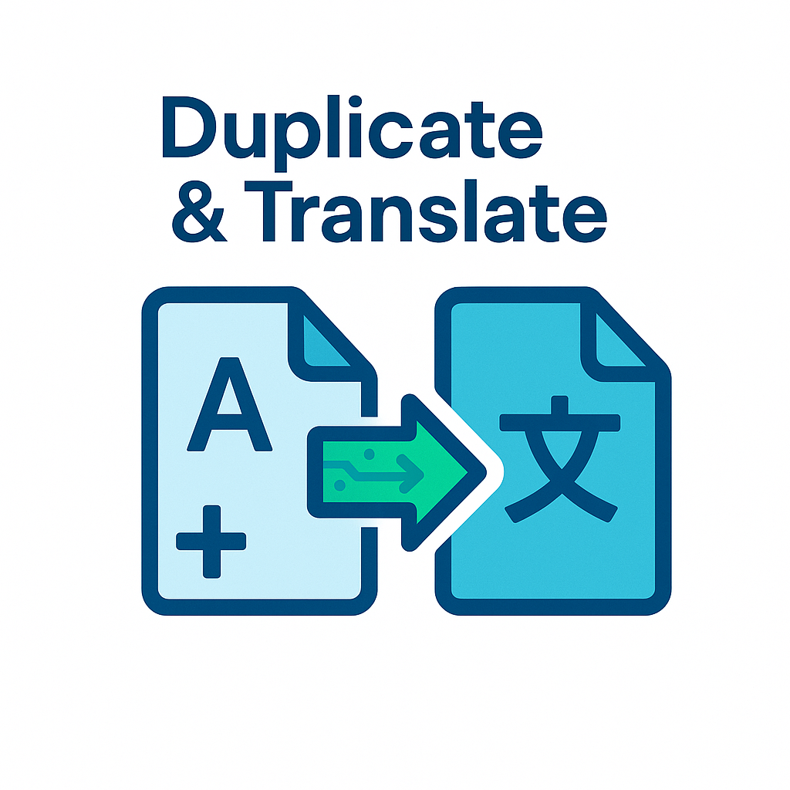

# Duplicate & Translate

Duplicate & Translate is a WordPress plugin that allows you to easily duplicate a post and translate it into another language using the OpenAI API.

## Features

*   **One-click duplication and translation:** Quickly create a translated version of any post.
*   **Compatible with most LLM providers:** OpenAI, Google, Anthropic, DeepSeek
*   **Gutenberg Block Editor Support:** Translates content from various core Gutenberg blocks, including headings, paragraphs, lists, quotes, buttons, and images (alt text).
*   **OpenAI Integration:** Utilizes the power of language models for accurate translations.
*   **Configurable Target Language:** Choose from a list of predefined languages to translate your content into.
*   **Secure API Key Storage:** Your OpenAI API key is stored securely in the WordPress database.
*   **User-friendly Progress Page:** A real-time progress page keeps you informed about the translation process.

## Installation

Soon available on the WordPress Plugin marketplace.

## Usage

1.  **Configure the plugin:**
    *   Go to **Settings > Duplicate & Translate**.
    *   Enter your OpenAI API key.
    *   Select your desired target language.
    *   Click **Save Settings**.

2.  **Translate a post:**
    *   Go to **Posts > All Posts**.
    *   Hover over the post you want to translate.
    *   Click the **Duplicate & Translate** link.
    *   A new tab will open, showing the translation progress.
    *   Once the translation is complete, you will be given a link to edit the new translated post, which will be saved as a draft.

## Author

This plugin is developed by Judicael Poumay.

*   [LinkedIn](https://www.linkedin.com/in/judicael-poumay/)
*   [Website](https://thethoughtprocess.xyz/)
*   [Email](mailto:pro.judicael.poumay@gmail.com)

## License

This plugin is licensed under the GPLv2 or later. See the [LICENSE](LICENSE) file for more details. 